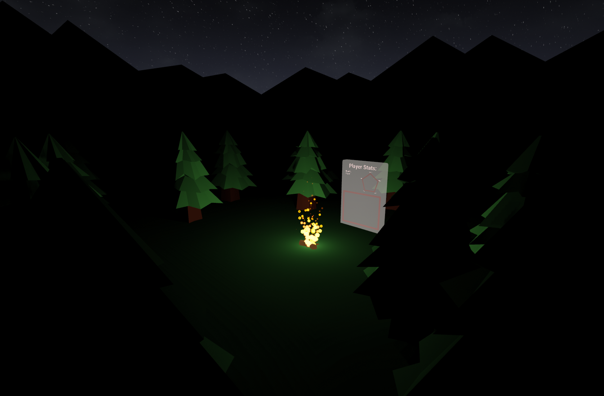
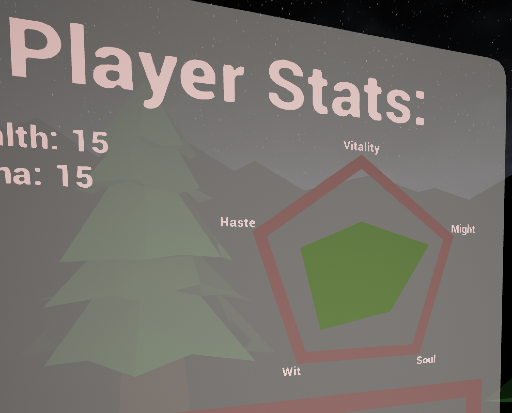

# Blog for October 13, 2023
## Work for this Week
So this week, I mostly refactored the save system to support single file saves.
I've already talked about that, but since then, I've configured the save system to load specific saves as well.

I've also created the stat info board present in the campfire world.

Most of the stats are simple integer values, which can be written to a Text actor to display them in the world.
However, the core stats (Wit, Vitality, etc.) need to be displayed in a Pokemon-esque polygon display, where each stat
is a vertex around a polygon, extending a distance relating the to value of that stat. 
To do this, I created a `ProceduralMesh`, which is wrapped in a function that takes an array of values and generates a
polygon for those values procedurally.

On another note, the mountains in the background of the Campfire world were also created by me.
I achieve this effect by creating a ring of offset vertices, and then place a couple of the rings at a very large scale
around the world.
And boom, you get a slightly parallaxed mountain effect, which I think looks pretty cool.

And that's all for this week really. I hope to get character selection to work with the save system next week, but
*cough* *cough* that might take some work.

Oh, and also items I guess.