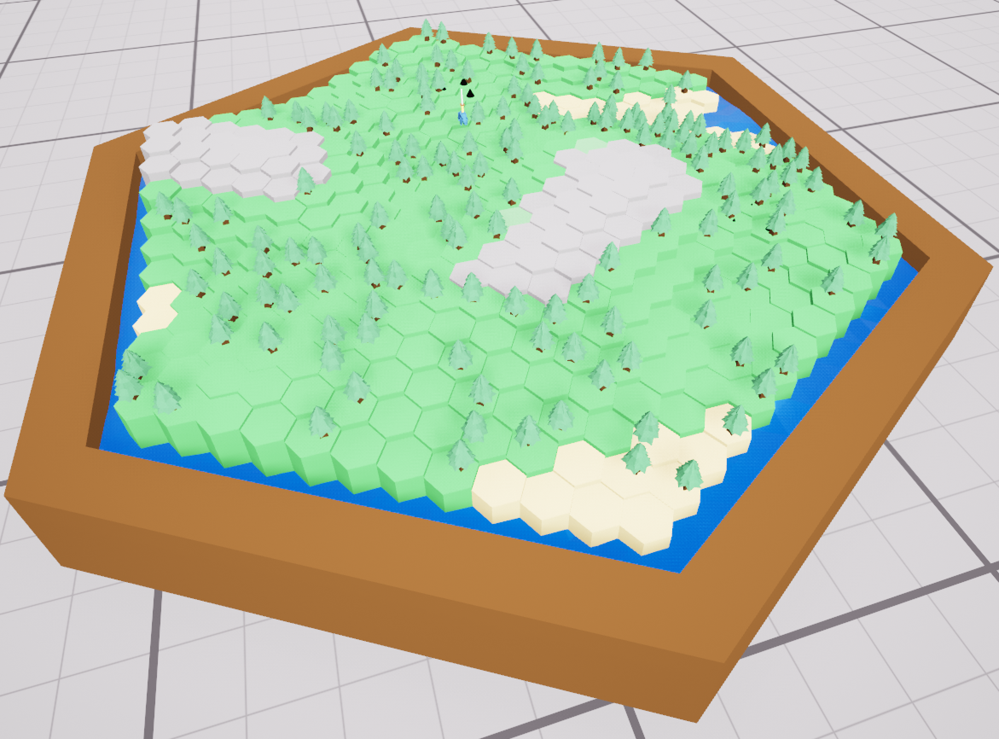

# Blog for October 27, 2023
## Work this, well, last two weeks I suppose...
It's been awhile since I've written my last project blog, so I've got a lot to talk about.
Most importantly, our team had our project review this week, which kinda went how I expected, basically we don't have a
playable game in any sense.
However, it did allow our artists to get a little more on track, which is great!

But I digress. I've mostly been working in the board world since the last project blog, mostly fixing bugs.
There's been a ton of issues with generation and making it work with other people's stuff.
Things were extremely broken when going into first person, which is now mostly resolved.

Oh! I also added player loading into the board world.
The game now gets saved player data from file and attaches it to each player's respective pawn piece.
With this, I can now correctly load important player stats for use in the game, such as Haste.
Speaking of Haste, it is now tied to how far a player can be moved, meaning a player can move more than one hex at once.
I achieve this by iterating over a each hex's neighboring hexes, and then adding them to a list of new hexes to iterate
on, rinse and repeat until you have reached a total amount of iterations that relates the the player's Haste stat.

Also, I changed the hexes to have their `UStaticMeshComponent`'s position changed instead of the object itself, which
fixes issues with placing details on the hexes.
Details now are correctly positioned even when the game reloads.
Here's some pine trees on the plains modifier:

On other notes relating to proc. gen, I can now spawn enemies in groups in a ring around the middle of the board, and
generations offsets are not created at runtime, so you get a different board every time.
I don't really know what else to say about that, but yeah.

Alright, so next steps, what am I gonna do?
I don't know honestly. We have a board of sticky notes which denote to things that need to be done, so I'm just gonna
keep working through those until everyone is ready to merge their stuff together.