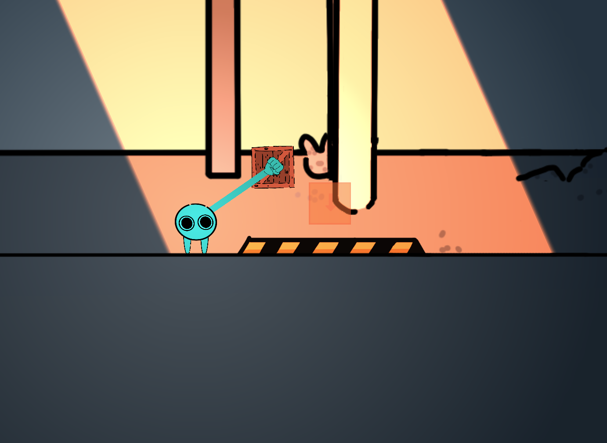
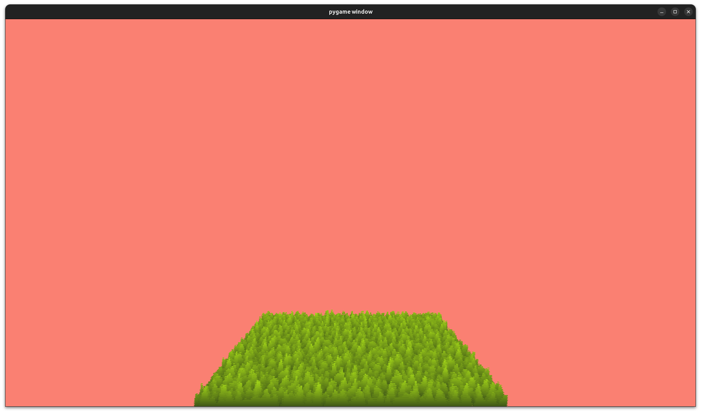
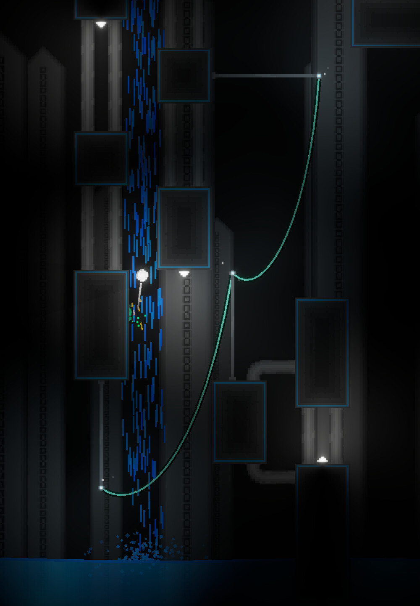

# Blog for December 12, 2023
Haven't posted here in forever, but I have a lot to talk about!

Let's kick it off talking about **Heroes of Paligon**. 


I've finally decided to switch over to proper mesh generation for the hex board.
This has brought immense performance gains all around, and has generally been a massive improvement.

The new system uses the `UProceduralMeshComponent` to generate the board.
This component has practically all the needed features, such as being able to define disconnected meshes, as well as
pass in vertex colors.
With these new capabilities, a much simpler biome modifier structure has also been implemented.
Instead of a `interface`, I have a general parent class `BiomeModifier`, which has the following functions:
```c++
TArray<FVector> GetHexOffsets(TArray<FVector> hexPositions);
TArray<FLinearColor> GetHexColors(TArray<FVector> hexPositions);
TArray<UBlueprint*> GetHexDetails(TArray<FVector> hexPositions);
TArray<HexType> GetHexTypes(TArray<FVector> hexPositions);
```
Each of these functions is called on the generated hex positions from the main `MeshBoardGenerator` class, which then
uses their output to properly generate the board in a single pass. 
This new coupled system is far superior to the previous system, as it allows biomes classes that inherit from
`BiomeModifier` to disregard access to hex data, and simply act as a set of operations.
It also allows detail generation to be easily handled by the board generator, instead of needing _another_ decoupled
generation class.

The only major drawback to the mesh generator is that hex data is now separate from the physical hexes,
but generally, this doesn't cause that many problems. A empty actor with a `USceneComponent` and the previously used
`UHexComponent` can function the same way as they did prior to these changes.

<hr>

Alright, moving away from Heroes of Paligon, the previous middle few weeks in November were spent working on another game
jam. 
In this instance, the theme was "Upside Down".
As by the decision of other designers, our group (in this case consisting of eight people, I believe) started work on
a small, local multiplayer platformer.
In essence, the game consists to traversing sequential levels with the goal of flipping very types of boxes over so
that they face upside down.



For this project, I was mostly dedicated to working on the player code.
And as you can imagine, the game being a physics based platformer and whatnot, led to me spending the majority of my
time fixing collision bugs.

By far the most challenging bug to fix was preventing players from creating an enclosed chain.
If a chain of players, which should be allowed in the game, is able to grab itself, then all hell breaks loose.
To fix this, I implemented a recursive chain check, where, upon a player attempting to grab another player, it would
recursively check if the player was grabbing a player who was grabbing a player, etc., until either the player being
grabbed was not grabbing anything or wasn't grabbing a player, or that the player being grabbed was grabbing the player
who initially called the check.
In pseudocode, this is what I mean:
```c++
check_player(player):
    if player.grabbed_object is player:
        if player.player_grabbed is this_player:
            return true // Fail grab
            
        check_player(player.grabbed_object) // continue down chain 
    else:
        return false // Succeed grab
```

All in all, I think this project turned out great. 
I believe that our focus in multiplayer interactions made the game truly enjoyable, and is definitely something to
strive for.

<hr>

In other projects, I created a very simple shell texturing implementation using, of all things, PyGame.



This technique is much more simple than you might expect.
It consists of progressively drawing layers of a noise texture with a decreasing cutoff.
In this case, it is used to render a grass effect, however the technique is also very proficient at drawing fur.
Being python, each of these frames takes about 1-2 seconds to draw, but that's down from my starting point of around 150
seconds.
The largest optimization I made was precaching the noise texture, which took the render time down to around 4 seconds.
Further caching the color interpolation values shaved another 2 seconds or so off.

The code for this project is available on my GitLab account by the same name.

<hr>

Continuing on with personal projects, I finally released the second update for Radii
(I think this occurred a couple of days before my previous blog, but I forgot to mention it).



I don't have too much to say about this, reception has been generally good, but not that many people have played it.

<hr>

That's about all I worked on this month. Some stuff, but not a ton.
I'm working on making a Vulkan renderer currently, but I haven't a ton to show for that yet, so expect more on that in


But for now, adios!