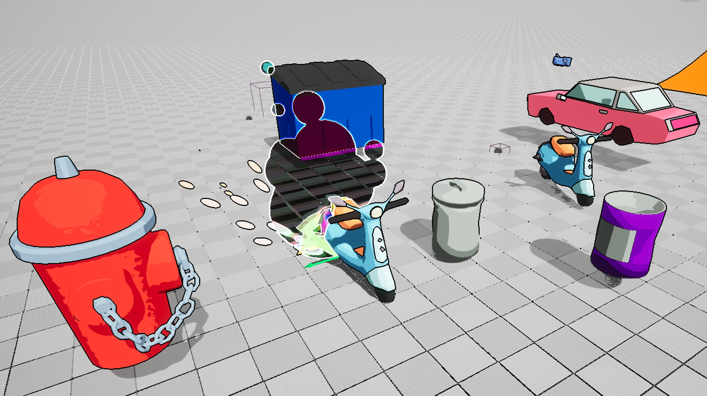

# Blog for February 9, 2024
New year, new project, I suppose.

After working for a few more days on our old project, Heroes of Paligon, it became clear to us that the game wasn't
going anywhere fast, and that if we wanted a more finished product by the end of the year, then we would need to 
switch to a new, smaller project.
After brainstorming some ideas for a couple days, we settled on creating a arcade racer, with similar visual aesthetic
to the game _Jet Set Radio_.

That's more or less the gist, and we immediately hopped into prototyping.
For this game, which we have begun to call _Slip Drift City_, our target style consists of a sort of wacky
urban jungle vibe.
As such, our initial prototyping consisted of creating a moped vehicle and a simple track to drive it on.

But before we could even really begin work, huge issues popped up with Unreal.
You see, core to this game (and really any arcade racer) is couch multiplayer.
However, as of Unreal 5.3, this functionality is essentially broken, as it was never patched after Enhanced Input
Actions were introduced in Unreal 5.1.

And thus began, a two week odyssey of attempting to fix this issue.
Really, there were three options:
1. downgrade to Unreal 5.0.3, which removes EIAs, but would require using windows as the input drivers on Mac were
broken in that version.
2. Switch to Godot or some other game engine.
3. Attempt to compile a beta build of Unreal 5.4, which had a few commits that seemed to fixed the various encountered
issues.

So let's break these down. First, switching to Unreal 5.0.3. This is probably the worst option of the bunch, because
not only were input drivers broken entirely, so the entire purpose of switching, to fix local multiplayer, wouldn't
work on Mac regardless. 
In addition, this version didn't have support for Apple Silicon, which means it ran through
Rosetta, and would provide far from optimal performance. This was essentially a no-go, even if technically the
easiest path.

Second, we could switch engines. Really, this option doesn't have any major caveats, other than the fact that the
majority of the team would have to learn a new engine.
I was even able to create a mockup of both post-processing effects and local multiplayer running in Godot without
issue.
However, I was unable to convince the rest of the team to switch in any capacity, so this idea was thrown out.

Which left the last option, attempting to compile a beta version of Unreal.
In reality, this wasn't the most difficult thing, other than having to download _nearly 200Gb_ of source code.
This took _ages_. I mean, downloading the compressed _built_ engine already takes about an hour by itself.
So I had to offload this work to our instructor (thank you!), who was able to spend the time downloading it,
and then about forty minutes of time was required to compile the code.
After all that, which in total was about a two week process from diagnosing the problem to compiling the engine, I
was finally able to test local multiplayer, and to my surprise, it actually worked perfectly.

However it isn't all perfect. Because of the fact that the engine is built from source, trying to compile _any_ C++
code will attempt to compile the entire engine again, and I haven't found a solution for this yet.

So, after that debacle, development could actually begin.
Pretty quickly we had a scooter prototype up and running, and the general post-processing vibe down.
There isn't really to much else to mention, because things have been fairly smooth sailing thus far.

Here's a quick screenshot of our current collection of assets:

We decided early on that we were going to ditch Unreal's built-in vehicle system, and create our own.
Other than nearly losing my mind working in Blueprints (they really are a piece of work), I, along with the other
programmers, have gotten our vehicle to feel more or less convincing, but it definitely needs a lot of work still.

My next steps are to really start to create a more final structure in our code.
First, I need to create a generalized vehicle controller, so that we can easily create and configure and vehicle.
I also need to make a track system, and I've been researching algorithms for player placement and whatnot.
The only real obstacle I'm facing with this right now is attempting to access our track, which is built with
landscape splines, and is therefore not accessible in Blueprints.

So yup, that's basically a wrap for that.
I hope to provide some more concrete game examples in the next blog, as we're into that stage of prototyping at this point.