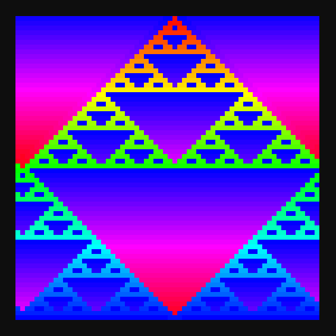

# Blog for April 4, 2024
If you couldn't tell, I've given up the effort of updating this frequently, but here I am!

Let's jump straight into a game jam that took place in early March.
The theme for this jam was particularly interesting, "Not a Game".
Essentially (but open for interpretation) we had to create a project that did not necessarily represent a game.
The most obvious thing to me, at first, was to create an automaton.

For those unaware, an automaton is a finite state machine which takes an input and acts directly upon that input.
The most common example of this is a cellular automaton, where the input is a grid of cells with set state (usually on
or off), and then a algorithm is performed upon that grid repeatedly, changing the grid each time.
Conway's Game of Life is the most famous cellular automaton, where a cells next state is defined by how many of its
neighbor states are active.

My team's project was then solidified as a extension of Conway's Life, where the user can change the rules of the
automaton, namely which neighbors are considered, and what actions are performed based on those neighbors.

Automatons present an interesting programming challenge, as they need to perform a large number of operations across a
large grid of cells. 
We chose to use Godot for this, mainly because of its robust UI system, which we would need to collect user input.
As a prototype, I recreated Life with GDScript, utilizing nested integer arrays.
However, it became immediately clear that this was a task that GDScript was simply not up to, as a basic single-state
64x64 grid took more than 100ms to _compute_, nonetheless update.
Therefore, I immediately switched to C#.
With C#, I was able to use a multidimensional byte array (`byte[,]`) to represent the grid.
Doing this, I was able to increase the performance by more than an order of magnitude, down to about 3-4ms compute time
for a 64x64 grid.

With the performance target now well met, we were able to begin adding the ruleset.
For the neighbor count rules, I simply used an `enum` which contained the list of specific actions to take, and then an
array of this `enum` of length nine, with each element at index `n` representing the action taken when the cell has
`n` neighbors.
Performing a switch on `enum[n]` would then call a series of functions.

I then moved on to the trickier problem, changing the cells which are considered neighbors (also known as a neighborhood).
My immediate thought was to simply use a `bool[]` of length 8 to store which represents the neighborhood.
However, I quickly realized that I could use a bitmask to represent the neighborhood, and perform a simple bitshift
to compare each cell. 
This bitmask essentially acts as a list of considered cells, where each bit represents a cell at each index surrounding
the target cell.
I can then take each cell and bitshift its state to the left by its index (really 7 minus its index), and do a bitwise
or (`|`) with the result and the bitmask and check whether it's greater than zero.
If it is, the check passes.

For example, to check the neighbor cell at index 4 (which is the cell located directly right of the target cell),
with the bitmask `0b01011010` (a checker pattern), the state is first shifted to the left by 3 bits (let's assume the
cell is active), which results in the mask `0b00001000`. 
`0b01011010 | 0b00001000` then results in `0b00001000`, which is greater than zero, so the check passes, and the neighbor
is considered towards the total count.

Now that the basic ruleset was in place, I tied it into the UI, and did some other polish things to finish up the project.
To better visually represent the way the grid evolved, I tracked the time that each cell was alive, and then did
a hue interpolation based upon that.
For example, if a cell had been alive for 50 of the total 100 generations that the automaton had been running, and the
user had selected to interpolate between the hue values of 0 and 1, the cell would appear blue.
Overall, this creates some astounding (and seizure inducing) visuals, like this one:

In this example, the coloring gives temporal information about how this fractal generates.

On top of that, I also made some short audio clips (with GarageBand) which I vertically composited to create
adaptive music.
Just a single layer is played at idle, and two additional layers are played when the automatons runs.
If the automaton detects that it is looping (in other words, a two generation buffer is the same as the current gen),
then one of the layers fades out, leaving too playing.
I was honestly surprised how much more intriguing even just this bit of music was, and it helped to provide _even more_
context to what was happening with the automaton.

With that, the project was basically complete.
Others on the team implemented a tutorial (thank you Hiro!), and we submitted the game to the jam page.
After the week long voting period, we ended up in 1st place (yay!), getting either 1st or 2nd in every voting category
other than "Ambition".