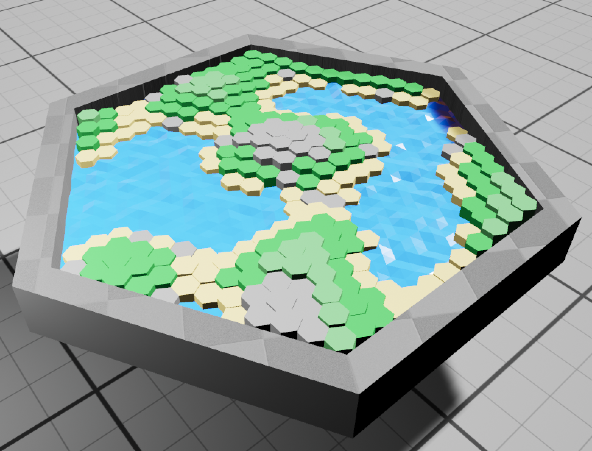
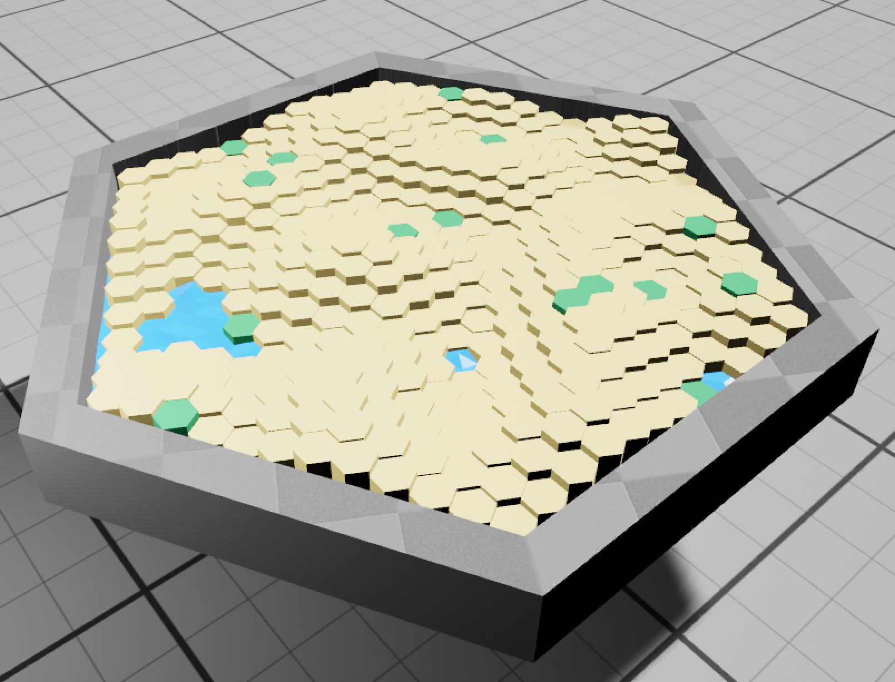
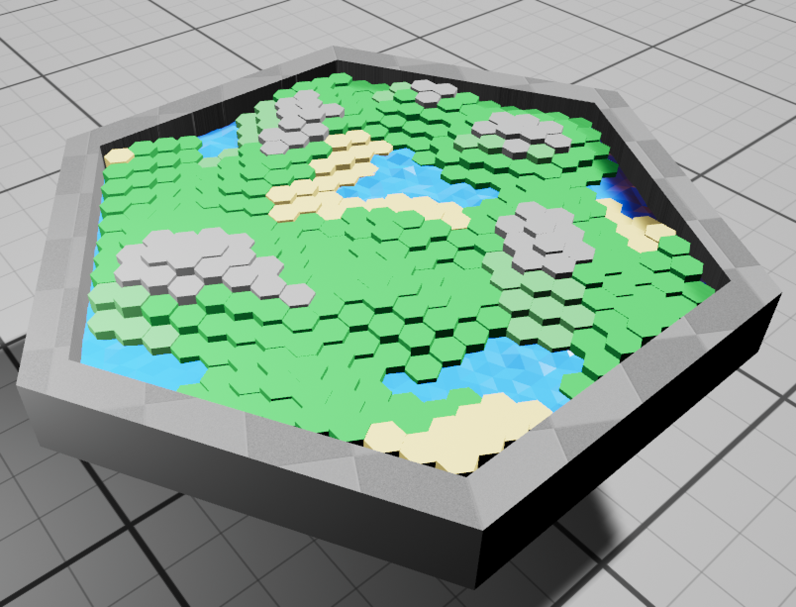
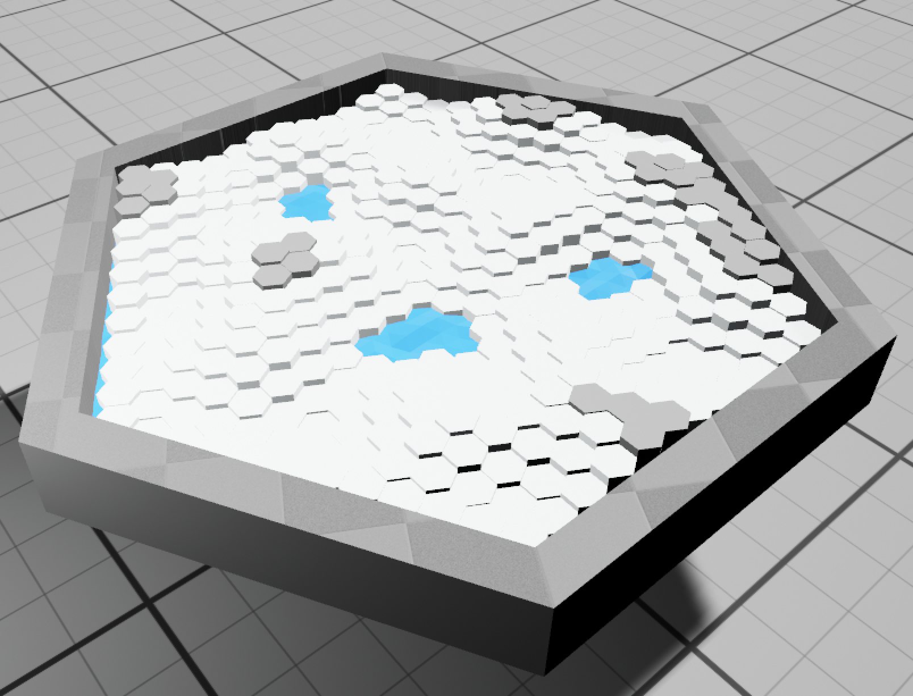

# Blog for September 13, 2023
## Work Today:
So far this week I have been finishing up the biome generators (which are now to a usable point)
and I have begun to create a hex board manager script.
Along with that, Andrew and I have been improving the game's water, which we think is lookin' pretty good.

Here's a gallery of the biomes:

`The Coast`

`The Desert`

`The Plains`

`The Tundra`

The new water is clearly visible in the coast and plains biomes (the coast is my favorite).
The water effect is achieved by applying a simple vertex shader to a single tessellated plain which sits at the bottom of the hex board.

Unfortunately, this is the last of the fun stuff for a while.
I now have to create the proper controls to move player pieces around on the board.
As I stated before, I've created a `GameBoardManager` class which handles the placement of pawns.
To aide in this, each hex tile is now designated a `HexComponent` component, which stores both the tile type (in an `enum` type),
and a linked list of neighbouring hexagons.
When a player moves, hexes can be traversed (maybe recursively) through their linked lists.
This allows for much more functionality in terms of move types, as the way the hexes are traversed can be modified to fit any particular need.

Other than that, I don't have much else to say for this week thus far (other than RIP Unity).