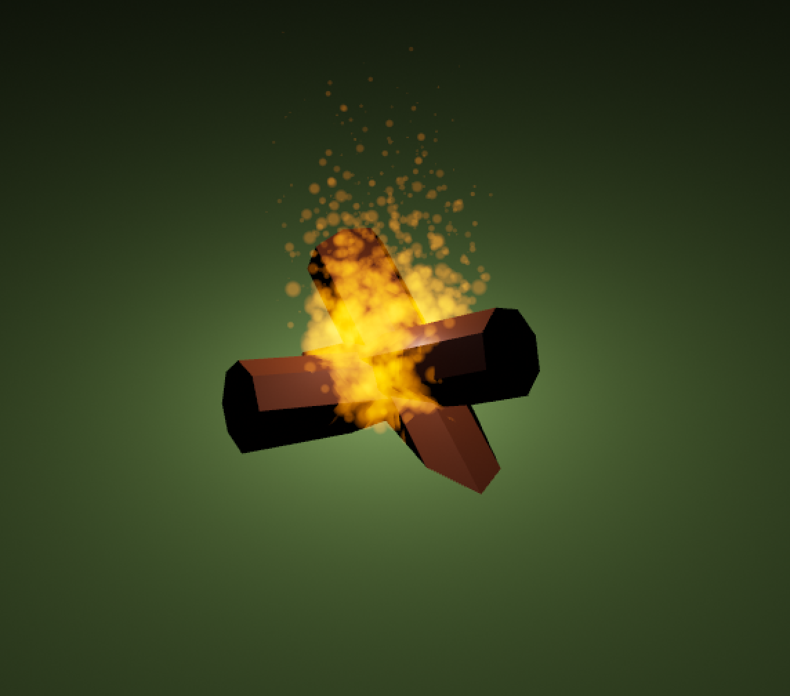

# Blog for September 20, 2023
## Work Today:
Thus far this week, I honestly haven't done a ton that I can show.
I created a simple detail (assets placed on top of hexes like rocks, chests, etc.) system which allows me to spawn details
procedurally.
This more or less follows the same generation technique as the hexes, but it instead takes the type of the hex it is generating on
to define the generation.
However, as we don't have many assets, there isn't a whole lot I can do in order to fully implement the system,
so I have instead moved on to working on the campfire system.

The campfire system is a break in between rounds of the game, where players can chill for a moment, look over stats,
and buy new items.
I just started laying out the world, creating a campfire (pictured below), which took me forever to make the particles
for.

Along with that, I, along with Andrew, have been defining the layout for the campfire scene, and I plan to begin work on
the stat board tomorrow.
Some of the other stuff I mentioned in the last blog, namely highlight decals and a move indicator have also been
implemented as part of `GameBoardManager`.