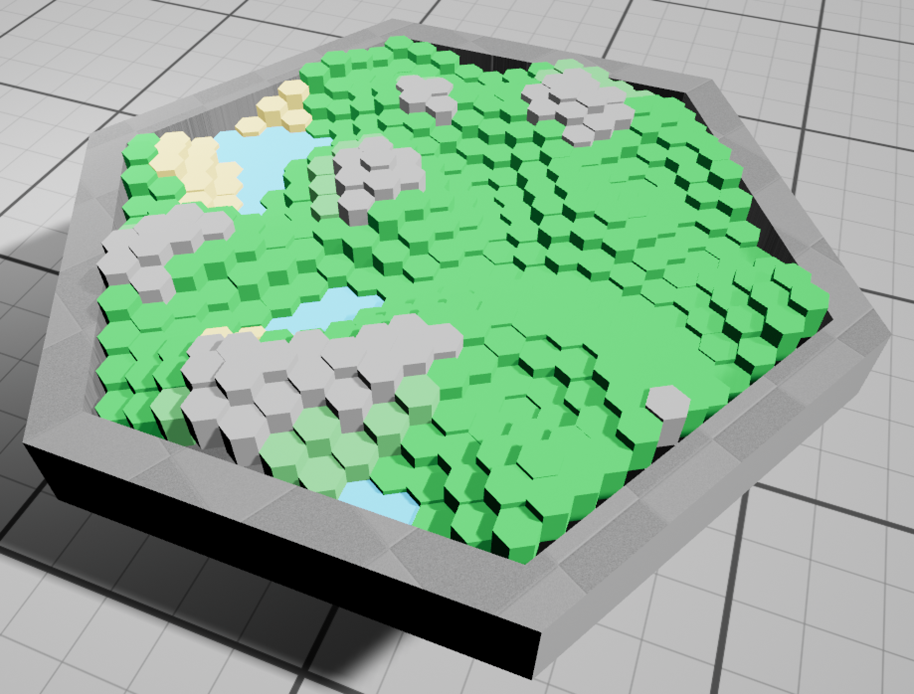
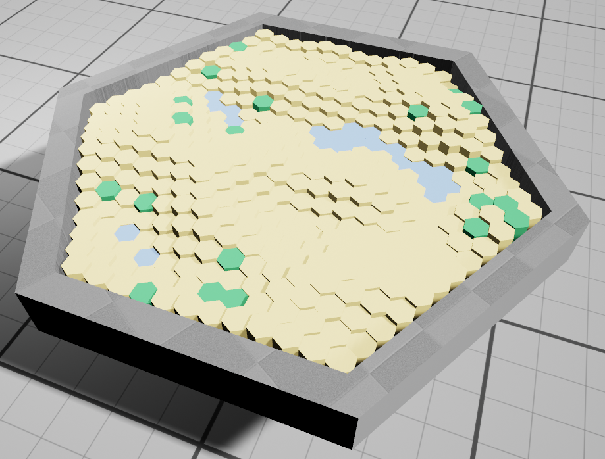

# Blog for September 8, 2023
## Work Today:
Today and yesterday I worked on creating a more robust system for procedural generation.
To do this, I created a `ProceduralModifier` interface, which allows me to generalize all types of generation.
Instead of changing the hexes when they are generated, a class inheriting from `IProceduralModifier`
instead modifies the attributes of the hexes independent of the hexboard generator (`AHexGenerator`).
This allows for much greater scalability and customizability of generation.

For example, it is now easily possible to create generic generators for any kind of biome:

<i>Plains Biome</i>

<i>Desert Biome</i>

Settings for each biome can be saved in a blueprint and easily applied just by dragging the blueprint into a scene where
the hex board is present. 
With this system, it is possible build a procedural biome in around an hour using C++, and may be possible to expand
functionality to blueprints, though I haven't tried this yet (nobody else wants to work on proc. gen at the moment).

As for next steps, I need to now create the three remaining biomes, the mountains, the tundra, and the coast.
Once I have these biomes in place, I can remake the player piece mechanics, which I decided to remove to make the board
generator much less specific.
I will likely take a similar approach to the player pieces as with the procedural modifiers, making them completely
separate from the board, which will help greatly with scalability.
Instead, I will probably have one `PieceController` class which handles interactions between the pieces and the board,
and then each piece will have a class to interact with both the player and the controller.

Other than that, I haven't much else to say other than the fact that I am really enjoying working on this type of system 
stuff. These are the kinds of things that I really enjoy in game development.