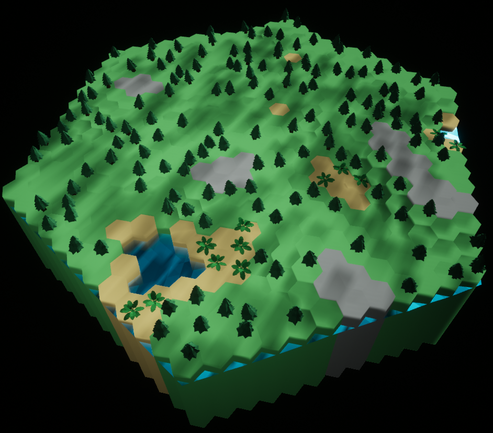

# 2023-2024 Post Mortem

Man, I feel like I did so much this year, and yet so little at the same time.
Essentially, so many projects, but not much outcome (except for maybe the last one).

## Large Projects
I worked on a total of two larger projects over the year, Heroes of Paligon, and Slip Drift City.

### Heroes of Paligon
Our first project this year was Heroes of Paligon (HoP), which, in short, was a multiplayer, VR tabletop game.
And you might be saying, "Man, that sounds like a lot for a group of amateurs", and you'd be right.
Without a doubt, it was too much of an undertaking for our team, and it would have been better to focus on
at most one of those elements.

While it was clear the scope of the project was well beyond what it should have been, this project still contained
what I'd consider to be the coolest thing that I worked on this year, which was procedural generation.
Working on this feature required me to finally jump into C++ more than I ever had before, which was a fantastic
learning experience, if nothing else.

Procedural generation ended up becoming a _massive_ rabbit hole, and I spent the majority of the first
semester working solely on that one feature.
The idea was simple enough, but I decided it would be beneficial to extend it to something extremely scalable,
which I ultimately succeeded with by using `interface`s, but in retrospect I spent way too much time on it.
If I had decided to leave it in a somewhat functional state, at least something good enough for a prototype, I could
have dedicated myself elsewhere, and allowed the team to move forward with a functional prototype much faster.

In the end though, after countless optimizations and improvements, I ended up being able to generate a hex board
similar to this:

But again, while cool and all, this isn't really what the team needed.
What the team really needed to succeed was a very, very basic prototype with all (and only) the core elements of the
game, which were multiplayer, the game loop, and combat.
Again though, this was probably still too much for our team to complete in a reasonable time, and it was very unlikely
that any prototype would be immediately fun anyways.
Exacerbating the issue was the fact that in order to test the game, we had to move our changes over to a VR station in
a room a couple doors down, and then struggle to run Unreal on a ancient 6th gen i5.

In the end, the project fizzled out, and is left in a state of containing _most_ of the core features (excluding
multiplayer), but with very little substance between them.

### Slip Drift City
After deciding to stop development on Heroes of Paligon, we moved onto our next project, and arcade racer.
Hopefully, this project would provide us with a much more manageable scope, where we could actually finish something
substantial, and most importantly, fun.

And I think, thus far, we've succeeded in that goal, whether or not I contributed much to that is debatable, however.
Without a doubt, getting a functional prototype for this game was _significantly_ easier than the previous project.

But really, I _struggled_ with working on this game.
I just _could not_ find something to be excited about for it.
Maybe it's because I was relegated to the more boring task, maybe it's that I don't really want programming to be my
job, just a hobby, I don't know.
Really, I think I just code to make _cool_ things, and very much to the fault of myself, I couldn't find many cool
things to make for Slip Drift City.

But it's not as if this project was a complete loss to me, I still made some stuff, and learned some stuff.
Most importantly it taught me that you don't always get to work on something you think is interesting, and that is
completely fine.

## Game Jams
Over the year, we had three game jams.

### Jam 1: Warren Tech 50th
Our first game jam of the year took place in early October, and was themed around creating something for Warren Tech's
50th anniversary.
The entire class decided to participate in a single project for this jam, which would be a _WarioWare_ style arcade game.
With this, the idea was that the class could be divvied up into smaller teams, which would all work to create separate
microgames, which would then all be placed into a single experience.

With only a week for the jam, this was simply a bad idea.
It would take at least a week (probably more) to successfully create _any_ kind of team dynamic that could sustain a
project like this, and thus, we weren't able to create much.
I mean, it wasn't _nothing_, there was a little bit of actual game in there, but nothing substantial in any regard.

What I learned from this jam was that, no, dividing work _does not_ mean that the time to complete that work will also
be divided, and that creating larger, more complete subteams is probably the way to go, if you want to divide work at all.

### Jam 2: Upside Down
Our second jam, taking place in December, went _much_ better than the first.
First of all, we had a much smaller team, and we also defined a much more manageable scope for our game.

For this jam, we decided to create a simple platformer, where the goal was to flip boxes upside down.
Taking inspiration from games like _Pikuniku_, the player would have some real funky controls, and most importantly,
the game would have local multiplayer.

Now _this_ project really had some potential.
Being as simple as it was, we had a working prototype within hours, and it was _already_ clear at that point that
the game was going to work, and work well.
Personally, I had a lot of fun working on this project (more than any other project I'd say).
If I'd to guess, this is probably a result of an amazing team and work dynamic.
It was extremely enjoyable to pull someone over, say, "Hey, look at this cool thing I made", and then test it out together.
On top of that, the game was just very silly in general, and it was a great time to just mess around with the mechanics,
even in the first prototype.

This project really taught me the importance of setting your project up for success from the absolute get go, and
how to keep that initial enthusiasm going for the entire time.

### Jam 3: Idyll
Our last jam, taking place in March, consisted of making a application that wasn't _really_ a game.
In essence, it could be anything, just not a game in a traditional sense.

I made the immediate choice to dip out of my current team to work on a much smaller one, as I couldn't see my original
team's current idea coming to fruition in the time of a game jam.
I'm still not entirely sure if this was the correct decision, but that's a discussion for another time.

Anyway though, left with the team I was with, we came to the conclusion that we should attempt to make an automaton,
basically an extension of Conway's Game of Life.
And this, _this_ is how you properly set yourself up for a game jam, and it likely can be extrapolated to larger 
projects as well.
You see, we started with a very simple concept, "Let's just make Life, and go from there", and go from there we did.
This was a _wonderful_ approach, because it left us with a basically finished project on day one, and then we could
just layer stuff on top of that, one thing at a time.

From Life, we made a completely configurable Life, and then we made it pretty, and then we added music.
In the end, we didn't finish all the ideas that we had to extend the game, but that didn't matter.
The state the game was left in felt complete, because it was really _always_ in a complete state.

The only thing that we really struggled with in this jam was distributing work, because the "one thing at a time"
approach doesn't really go along with that extremely well.
So, I'd really like to take this approach again and try to apply a little bit more flexibility into it, just to allow
more work to be completed in parallel.

This is the only time I'm going to do this, but to get a detailed description on the technical aspects of this project,
please refer to the blog for April 4th, 2024.

## Conclusion
In the end, I'm left with a bit of a sour taste in my mouth, most of which stems from regret.

I know that I didn't apply myself at the level I should have this year.
I _knew_ that I was a competent programmer, but I just never stepped up to the task, for fear of _something_, though I'm not
really sure what at this point. 
In addition, I'm not really sure if I chose my team wisely.
At the beginning of the year, I chose to go with the team that seemed to have the most experience, when in reality,
I should have tried to join a team with a little more common sense.
Or maybe I should have tried to make my own team, I don't know.
What I do know is that I had absolutely realized, especially at the start of working on Paligon, that what we were
creating was unrealistic, and I should have been more vocal about that, or simply worked on a project with a better
scope.
It pains me (for some reason, probably not for any good one though) to not have a finished product at the end of the
year, and looking back, I see many opportunities where I could have set myself (and a team) up to do just that.

But it isn't all bad, not by any means.
I actually was succeeded in the two major goals I set out to complete this year, learning Unreal and learning HLSL.
But again, these are both things I very well could have taught myself, on my own time, and so I still don't really
see a reason to have learned them here, necessarily.
I feel I could've much better spent my time learning something that I'd need a little more aid with, heck, even art
or something.

But, as was the goal of the whole WT program, I learned how to work on a team.
I wouldn't say I learned how to work on a team _well_, not by any means, however I'd say that I got some invaluable
experience in that area, which I wouldn't have gotten anywhere else.

I'm not exactly on great terms with the team however, and for good reasons on the part of the other members.
I'm overly negative, overly critical, and yet I don't actually produce much (most of which is my own fault).
As such, I haven't really garnered any respect from the other members of the team, which, while painful, is very much
warranted.

That's about all I have to say.
In conclusion, if I could, I would change basically every aspect of the way I approached Warren Tech, and my projects,
and really everything I've done over the past year.
But in any case, I had some moments of fun, and I'm not really sure what I would've been doing other than this program,
so in that regard, this year was very successful.